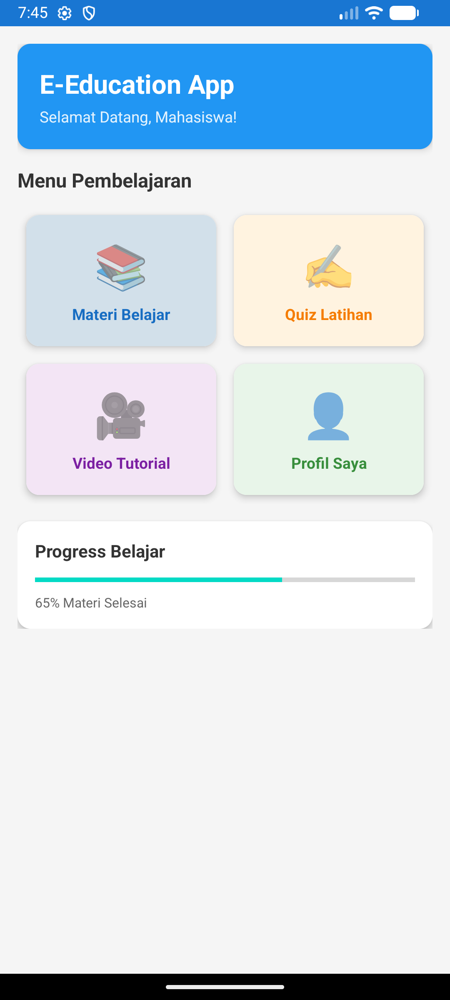
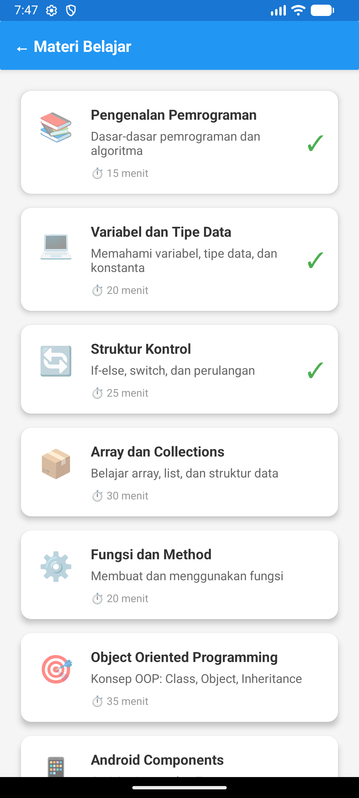

# E-Education App 📚

Aplikasi Android untuk pembelajaran E-Education berbasis mobile.

## 📋 Deskripsi Project

Aplikasi E-Education adalah platform pembelajaran digital yang memudahkan mahasiswa mengakses materi pembelajaran, mengerjakan quiz, menonton video tutorial, dan melacak progress belajar mereka.

**Dibuat untuk:** UTS Pemrograman Bergerak IF703  
**Studi Kasus:** E-Education  
**Dosen:** Ir. Ahmad Chusyairi, M.Kom., CDS., IPM., ASEAN Eng

## ✨ Fitur Aplikasi

- 📚 **Materi Belajar** - Akses berbagai materi pembelajaran
- ✍️ **Quiz & Latihan** - Uji pemahaman dengan soal-soal interaktif
- 🎥 **Video Tutorial** - Pembelajaran melalui video
- 👤 **Profil Pengguna** - Lihat progress dan informasi personal
- 📊 **Progress Tracking** - Monitor kemajuan belajar

## 🛠️ Teknologi yang Digunakan

- **Language:** Kotlin
- **IDE:** Android Studio
- **Min SDK:** API 21 (Android 5.0)
- **Target SDK:** API 34 (Android 14)

### Libraries:
- AndroidX Core KTX
- Material Design Components
- RecyclerView
- CardView
- ConstraintLayout

## 📱 Screenshot

### Dashboard


### Materi Belajar


## 🏗️ Struktur Project

```
EEducationApp/
├── app/
│   ├── src/
│   │   ├── main/
│   │   │   ├── java/com/mahasiswa/eeducation/
│   │   │   │   ├── MainActivity.kt
│   │   │   │   ├── MateriActivity.kt
│   │   │   │   ├── Materi.kt
│   │   │   │   └── MateriAdapter.kt
│   │   │   ├── res/
│   │   │   │   ├── layout/
│   │   │   │   │   ├── activity_main.xml
│   │   │   │   │   ├── activity_materi.xml
│   │   │   │   │   └── item_materi.xml
│   │   │   │   └── values/
│   │   │   └── AndroidManifest.xml
│   │   ├── test/ - Unit Tests
│   │   └── androidTest/ - UI Tests
└── README.md
```

## 🚀 Cara Install & Menjalankan

### Prasyarat:
- Android Studio Arctic Fox atau lebih baru
- JDK 8 atau lebih tinggi
- Android SDK API 21+

### Langkah-langkah:

1. **Clone repository**
```bash
git clone https://github.com/username-anda/EEducationApp.git
```

2. **Buka di Android Studio**
    - File → Open
    - Pilih folder EEducationApp
    - Wait for Gradle sync

3. **Run aplikasi**
    - Klik tombol Run (▶️)
    - Pilih emulator atau device
    - Wait for build & install

## 🧪 Testing

### Unit Test
```bash
./gradlew test
```

### Instrumented Test
```bash
./gradlew connectedAndroidTest
```

## 📦 Build APK

### Debug APK
```bash
./gradlew assembleDebug
```
Output: `app/build/outputs/apk/debug/app-debug.apk`

### Release APK
```bash
./gradlew assembleRelease
```

## 📋 Kriteria Penilaian yang Dipenuhi

✅ **Activities and Intents** - MainActivity & MateriActivity  
✅ **Testing** - Unit Test & UI Test  
✅ **Debugging** - Log.d & Toast messages  
✅ **Support Libraries** - Material, RecyclerView, CardView  
✅ **User Interaction** - Click listeners, dialogs, navigation  
✅ **Delightful UX** - Modern UI, smooth animations  
✅ **Testing UI** - Espresso tests

## 📄 License

Project ini dibuat untuk keperluan akademik UTS IF703.

## 📞 Kontak

Jika ada pertanyaan, hubungi:
- Email: [email-anda]@gmail.com
- GitHub: [@username-anda](https://github.com/username-anda)

---

⭐ **Jangan lupa beri star jika project ini membantu!** ⭐
